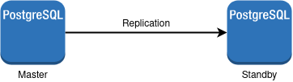
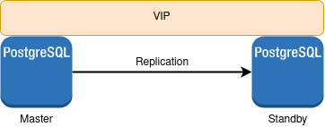
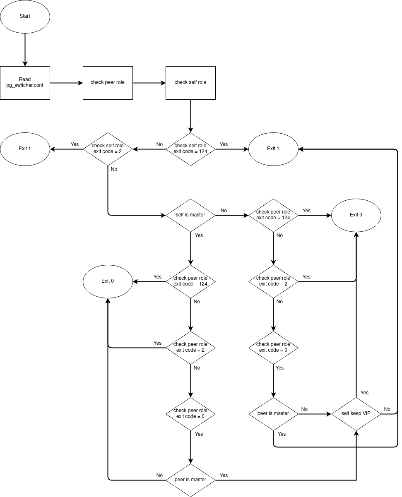
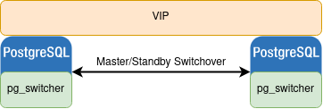
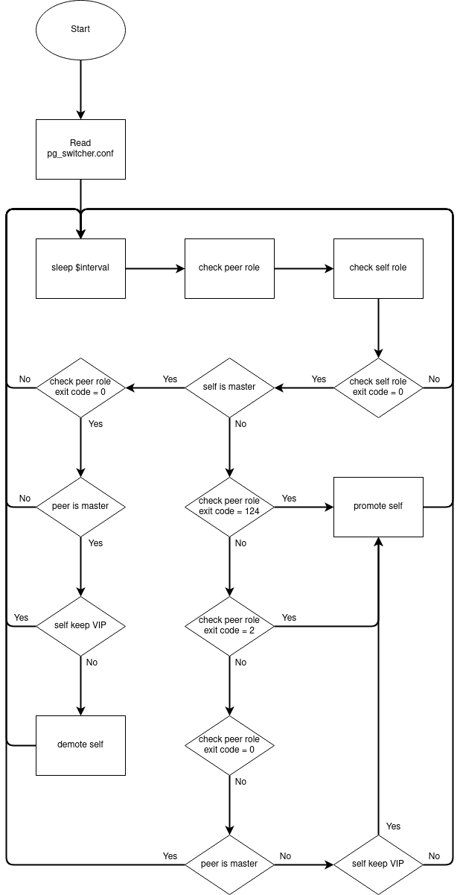

# postgresql

PostgreSQL 9.6 Replication installation & configuration (with keepalived and pg_switcher for switchover).

# Install and configure Master-Standby Replication with PostgreSQL 9.6 on CentOS 7




| Master IP     | Standby IP    | VIP           |
| ------------- |:-------------:| -------------:|
| 172.27.9.127  | 172.27.9.146  | 172.127.9.128 |


## Master

<details>
  <summary>Click to expand</summary>

Install PostgreSQL 9.6
```bash
yum install https://download.postgresql.org/pub/repos/yum/9.6/redhat/rhel-7-x86_64/pgdg-redhat-repo-latest.noarch.rpm -y;
yum install postgresql96 postgresql96-server postgresql96-contrib postgresql96-libs -y;
```

Init database and start PostgreSQL
```bash
cd /usr/pgsql-9.6/bin;
./postgresql96-setup initdb;
systemctl start postgresql-9.6;
systemctl enable postgresql-9.6;
```

Set password for postgres user
```bash
su - postgres;
psql;
```
```postgresql
\password postgres
```

Edit postgresql.conf
```bash
cd /var/lib/pgsql/9.6/data;

# writes the information needed to recover from a crash or immediate shutdown
# adds logging required for WAL archiving
# further adds information required to run read-only queries on a standby server
# plus information needed to reconstruct the status of running transactions from the WAL
sed -i "s/#wal_level.*/wal_level = hot_standby/g" postgresql.conf;

# wait for local flush of WAL to disk
sed -i "s/#synchronous_commit.*/synchronous_commit = local/g" postgresql.conf;

# 
sed -i "s/#wal_log_hints.*/wal_log_hints = on/g" postgresql.conf;

# completed WAL segments are sent to archive storage by setting archive_command
sed -i "s/#archive_mode.*/archive_mode = on/g" postgresql.conf;

# command to execute to archive a completed WAL file segment
# %p in the string is replaced by the path name of the file to archive
# %f is replaced by only the file name
sed -i "s/#archive_command.*/archive_command = 'cp %p \/var\/lib\/pgsql\/9.6\/archive\/%f'/g" postgresql.conf;

# maximum number of concurrent connections from standby servers or streaming base backup clients
sed -i "s/#max_wal_senders.*/max_wal_senders = 2/g" postgresql.conf;

# WAL logs are stored in the directory pg_xlog
# minimum number of past log file segments kept in the pg_xlog directory
# Each segment is normally 16 megabytes
sed -i "s/#wal_keep_segments.*/wal_keep_segments = 10/g" postgresql.conf;

# list of standby servers
sed -i "s/#synchronous_standby_names.*/synchronous_standby_names = 'pgslave01'/g" postgresql.conf;

# listen_addresses
sed -i "s/#listen_addresses.*/listen_addresses = '*'/g" postgresql.conf;
```

Create WAL archive folder
```bash
mkdir -p /var/lib/pgsql/9.6/archive/;
chmod 700 /var/lib/pgsql/9.6/archive/;
chown -R postgres:postgres /var/lib/pgsql/9.6/archive/;
```

Edit pg_hba.conf
```bash
# Client authentication is controlled by pg_hba.conf
cat << EOF >> pg_hba.conf 
# Localhost
host    replication     postgres          127.0.0.1/32            md5
 
host    all     postgres          172.27.9.127/32            md5
host    all     postgres          172.27.9.128/32            md5
host    all     postgres          172.27.9.146/32            md5
EOF
```

Open port
```bash
iptables -I INPUT -p tcp --dport 5432 -s 172.27.9.146,172.27.9.128 -j ACCEPT;
service iptables save;
```

Restart postgresql
```bash
systemctl restart postgresql-9.6;
```
</details>

## Standy

<details>
  <summary>Click to expand</summary>

Install PostgreSQL 9.6
```bash
yum install https://download.postgresql.org/pub/repos/yum/9.6/redhat/rhel-7-x86_64/pgdg-redhat-repo-latest.noarch.rpm -y;
yum install postgresql96 postgresql96-server postgresql96-contrib postgresql96-libs -y;
```

Init database and start PostgreSQL
```bash
cd /usr/pgsql-9.6/bin;
./postgresql96-setup initdb;
systemctl start postgresql-9.6;
systemctl enable postgresql-9.6;
```

Set password for postgres user
```bash
su - postgres;
psql;
```
```postgresql
\password postgres
```

Backup data before syncing up with master
```bash
systemctl stop postgresql-9.6;
cd /var/lib/pgsql/9.6/;
mv data data-backup;
mkdir -p data/;
chmod 700 data/;
chown -R postgres:postgres data/;
```

Syncing up with master
```bash
su - postgres;
pg_basebackup -h 172.27.9.127 -U replica -D /var/lib/pgsql/9.6/data -P --xlog;
```

Edit postgresql.conf
```bash
cd /var/lib/pgsql/9.6/data/;

# standby, read-only
sed -i "s/#hot_standby.*/hot_standby = on/g" postgresql.conf;
```

Create recovery.conf
```bash
# apply for the duration of the recovery
cat << EOF > recovery.conf
# start the PostgreSQL server as a standby
standby_mode = 'on'

# connection string to be used for the standby server to connect with the primary
primary_conninfo = 'host=172.27.9.127 port=5432 user=postgres password=postgrespw application_name=pgslave01'

# Specifies a trigger file whose presence ends recovery in the standby
# Even if this value is not set, you can still promote the standby using pg_ctl promote
trigger_file = '/tmp/postgresql.trigger.5432'

# recovers to the latest timeline found in the archive
recovery_target_timeline='latest'
EOF
```

Set permission for recovery.conf
```bash
chmod 600 recovery.conf;
chown postgres:postgres recovery.conf;
```

Open port
```bash
iptables -I INPUT -p tcp --dport 5432 -s 172.27.9.127,172.27.9.128 -j ACCEPT;
service iptables save;
```

Start postgresql
```bash
systemctl start postgresql-9.6;
```
</details>

# Install and configure keepalived for fault tolerance



## Master & Standby

<details>
  <summary>Click to expand</summary>

Install and start keepalived
```bash
yum install keepalived -y;
systemctl start keepalived;
systemctl enable keepalived;
```

Enable ip forwarding
```bash
echo "net.ipv4.ip_forward = 1" >> /etc/sysctl.conf;
sysctl -p;
```

Add firewall rules to allow VRRP communication using the multicast IP address 224.0.0.18 and the VRRP protocol (112) on enp0s8
```bash
iptables -I INPUT -i enp0s8 -d 224.0.0.0/8 -p vrrp -j ACCEPT
iptables -I OUTPUT -o enp0s8 -d 224.0.0.0/8 -p vrrp -j ACCEPT
service iptables save
```
</details>

## Master: keepalived configuration

<details>
  <summary>Click to expand</summary>

```bash
cat << EOF > /etc/keepalived/keepalived.conf
vrrp_script chk_pg {
  script "/etc/keepalived/pg_check.sh -c /etc/pg_switcher/pg_switcher.conf"
  interval 2 # every 2 seconds
  weight 2 # add 2 points if OK
}

vrrp_instance VI_3 {
  state MASTER
  interface enp0s8
  mcast_src_ip 172.27.9.127
  virtual_router_id 53
  priority 100
  advert_int 1
  authentication {
    auth_type PASS
    auth_pass 121221
  }
  virtual_ipaddress {
    172.27.9.128 # virtual ip address
  }
  track_script {
    chk_pg
  }
}
EOF
```
</details>

## Standby: keepalived configuration

<details>
  <summary>Click to expand</summary>

```bash
cat << EOF > /etc/keepalived/keepalived.conf
vrrp_script chk_pg {
  script "/etc/keepalived/pg_check.sh -c /etc/pg_switcher/pg_switcher.conf"
  interval 2 # every 2 seconds
  weight 2 # add 2 points if OK
}

vrrp_instance VI_3 {
  state BACKUP
  interface enp0s8
  mcast_src_ip 172.27.9.146
  virtual_router_id 53
  priority 99
  advert_int 1
  authentication {
    auth_type PASS
    auth_pass 121221
  }
  virtual_ipaddress {
    172.27.9.128 # virtual ip address
  }
  track_script {
    chk_pg
  }
}
EOF
```
</details>

## /etc/keepalived/pg_check.sh

<details>
  <summary>Flow chart</summary>


</details>

<details>
  <summary>Click to expand</summary>

```bash
#!/bin/bash

package=$0

echo_help () {
      echo -e "\nKeepalived checks pg"
      echo " "
      echo "$package [options] [arguments]"
      echo " "
      echo "options:"
      echo "-h, --help                show brief help"
      echo "-c, --config=CONFIG_FILE  specify configuration file"
}

check_peer_role () {
  peer_query_output=`timeout 0.2s bash -c 'PGPASSWORD=$peer_password psql -h $peer_host -p $peer_port -U $peer_user $peer_database -x -c "select pg_is_in_recovery()"'`
  peer_query_exit_code=$?
  peer_is_master=1
  if [ $peer_query_exit_code -eq 0 ] && grep -q "| f" <<< $peer_query_output; then
    peer_is_master=0
  fi
}

check_self_role () {
  self_query_output=`timeout 0.2s bash -c 'PGPASSWORD=$self_password psql -h $self_host -p $self_port -U $self_user $self_database -x -c "select pg_is_in_recovery()"'`
  self_query_exit_code=$?
  self_is_master=1
  if [ $self_query_exit_code -eq 0 ] && grep -q "| f" <<< $self_query_output; then
    self_is_master=0
  fi
}

while test $# -gt 0; do
  case "$1" in
    -h|--help)
      echo_help
      exit 0
      ;;
    -c)
      shift
      if test $# -gt 0; then
        export CONFIG_FILE=$1
      else
        echo "no configuration file specified"
        exit 1
      fi
      shift
      ;;
    --config*)
      export CONFIG_FILE=`echo $1 | sed -e 's/^[^=]*=//g'`
      shift
      ;;
    *)
      echo_help
      exit 1
      break
      ;;
  esac
done

[[ -z $CONFIG_FILE ]] && export CONFIG_FILE="/etc/pg_switcher/pg_switcher.conf"

line_num=0
while IFS= read -r line; do
  line_num=`expr $line_num + 1`
  line=`echo $line | awk '{print $1}'`
  case "$line" in
    peer_host=*)
      export peer_host=`echo $line | sed -e 's/^[^=]*=//g'`
      ;;
    peer_port=*)
      export peer_port=`echo $line | sed -e 's/^[^=]*=//g'`
      ;;
    peer_user=*)
      export peer_user=`echo $line | sed -e 's/^[^=]*=//g'`
      ;;
    peer_database=*)
      export peer_database=`echo $line | sed -e 's/^[^=]*=//g'`
      ;;
    peer_password=*)
      export peer_password=`echo $line | sed -e 's/^[^=]*=//g'`
      ;;
    self_host=*)
      export self_host=`echo $line | sed -e 's/^[^=]*=//g'`
      ;;
    self_port=*)
      export self_port=`echo $line | sed -e 's/^[^=]*=//g'`
      ;;
    self_user=*)
      export self_user=`echo $line | sed -e 's/^[^=]*=//g'`
      ;;
    self_database=*)
      export self_database=`echo $line | sed -e 's/^[^=]*=//g'`
      ;;
    self_password=*)
      export self_password=`echo $line | sed -e 's/^[^=]*=//g'`
      ;;
    postgres_service=*)
      export postgres_service=`echo $line | sed -e 's/^[^=]*=//g'`
      ;;
    PGDATA=*)
      export PGDATA=`echo $line | sed -e 's/^[^=]*=//g'`
      ;;
    PG_CTL=*)
      export PG_CTL=`echo $line | sed -e 's/^[^=]*=//g'`
      ;;
    PG_REWIND=*)
      export PG_REWIND=`echo $line | sed -e 's/^[^=]*=//g'`
      ;;
    PG_ARCHIVE=*)
      export PG_ARCHIVE=`echo $line | sed -e 's/^[^=]*=//g'`
      ;;
    VIP=*)
      export VIP=`echo $line | sed -e 's/^[^=]*=//g'`
      ;;
    "")
      continue
      ;;
    \#*)
      continue
      ;;
    *)
      echo "Unexpected entry in configuration file, line $line_num: $line"
      #exit 1
      break
      ;;
  esac
done < $CONFIG_FILE

[[ -z $self_host ]] && export self_host=127.0.0.1
[[ -z $self_port ]] && export self_port=5432

check_peer_role
check_self_role

if [ $self_query_exit_code -eq 124 ]; then
  echo "Is self_host correct? $self_host"
  exit 1
elif [ $self_query_exit_code -eq 2 ]; then
  echo "Is service $postgres_service running on host $self_host port $self_port"
  exit 1
else
  if [ $self_is_master -eq 1 ]; then
    if [ $peer_query_exit_code -eq 124 ]; then
      echo -e "Peer host $peer_host is stopped\nSelf host $self_host is running as slave\nPromoting self as master...1"
      exit 0
    elif [ $peer_query_exit_code -eq 2 ]; then
      echo -e "Peer service $postgres_service on $peer_host port $peer_port is stopped\nSelf host $self_host is running as slave\nPromoting self as master...2"
      exit 0
    elif [ $peer_query_exit_code -eq 0 ]; then
      if [ $peer_is_master -eq 1 ]; then
        echo -e "Both are running as slave"
        grep -q $VIP <<< `ip a`
        tmp=$?
        [[ $tmp -eq 0 ]] && exit 0
        [[ $tmp -eq 1 ]] && exit 1
      else
        echo -e "Self $self_host is running as slave.\nPeer $peer_host is running as master."
        exit 1
      fi
    fi
  else
    if [ $peer_query_exit_code -eq 124 ]; then
      echo -e "Peer host $peer_host is stopped\nSelf $self_host is running as master."
      exit 0
    elif [ $peer_query_exit_code -eq 2 ]; then
      echo -e "Peer service $postgres_service on $peer_host port $peer_port is stopped\nSelf host $self_host is running as master."
      exit 0
    elif [ $peer_query_exit_code -eq 0 ]; then
      if [ $peer_is_master -eq 1 ]; then
        echo -e "Self $self_host is running as master.\nPeer $peer_host is running as slave."
        exit 0
      else
        echo -e "Both are running as master."
        grep -q $VIP <<< `ip a`
        tmp=$?
        [[ $tmp -eq 0 ]] && exit 0
        [[ $tmp -eq 1 ]] && exit 1
      fi
    fi
  fi    
fi
```
</details>

## Master: /etc/pg_switcher/pg_switcher.conf

<details>
  <summary>Click to expand</summary>

```bash
cat << EOF > /etc/pg_switcher/pg_switcher.conf
peer_host=172.27.9.146                    # peer's IP
peer_port=5432                            # peer's postgresql port
peer_user=postgres                        # peer's postgresql user
peer_password=postgrespw                  # peer's postgresql password
peer_database=postgres                    # peer's postgresql database

self_host=172.27.9.127                    # self's IP
self_port=5432                            # self's postgresql port
self_user=postgres                        # self's postgresql user
self_password=postgrespw                  # self's postgresql password
self_database=postgres                    # self's postgresql database

postgres_service=postgresql-9.6           # postgresql service
PGDATA=/var/lib/pgsql/9.6/data/           # postgresql data dir
PG_ARCHIVE=/var/lib/pgsql/9.6/archive/    # postgresql WAL archive dir
PG_CTL=/usr/pgsql-9.6/bin/pg_ctl          # postgresql control bin
PG_REWIND=/usr/pgsql-9.6/bin/pg_rewind    # postgresql rewind bin
VIP=172.27.9.128                          # keepalived VIP
interval=10                               # interval time (in second) for role checking
EOF
```
</details>

## Standby: /etc/pg_switcher/pg_switcher.conf

<details>
  <summary>Click to expand</summary>
  
```bash
cat << EOF > /etc/pg_switcher/pg_switcher.conf
peer_host=172.27.9.127                    # peer's IP
peer_port=5432                            # peer's postgresql port
peer_user=postgres                        # peer's postgresql user
peer_password=postgrespw                  # peer's postgresql password
peer_database=postgres                    # peer's postgresql database

self_host=172.27.9.146                    # self's IP
self_port=5432                            # self's postgresql port
self_user=postgres                        # self's postgresql user
self_password=postgrespw                  # self's postgresql password
self_database=postgres                    # self's postgresql database

postgres_service=postgresql-9.6           # postgresql service
PGDATA=/var/lib/pgsql/9.6/data/           # postgresql data dir
PG_ARCHIVE=/var/lib/pgsql/9.6/archive/    # postgresql WAL archive dir
PG_CTL=/usr/pgsql-9.6/bin/pg_ctl          # postgresql control bin
PG_REWIND=/usr/pgsql-9.6/bin/pg_rewind    # postgresql rewind bin
VIP=172.27.9.128                          # keepalived VIP
interval=10                               # interval time (in second) for role checking
EOF
```
</details>

# Automatically switchover PostgreSQL master/standby with "pg_switcher" service



## Add /usr/lib/systemd/system/pg_switcher.service

<details>
  <summary>Click to expand</summary>

```yaml
Unit]
Description=Posgresql Replication Role Switchover
After=syslog.target network-online.target

[Service]
PIDFile=/var/run/pg_switcher.pid
KillMode=process
#EnvironmentFile=-/etc/sysconfig/pg_switcher
ExecStart=/usr/sbin/pg_switcher -c /etc/pg_switcher/pg_switcher.conf
ExecReload=/bin/kill -HUP $MAINPID

[Install]
WantedBy=multi-user.target
```
</details>

## Create PID file

<details>
  <summary>Click to expand</summary>

```bash
touch /var/run/pg_switcher.pid
```
</details>

## Create /usr/sbin/pg_switcher

<details>
  <summary>Flow chart</summary>
  

</details>


<details>
  <summary>Click to expand</summary>

```bash
#!/bin/bash

package=$0

echo_help () {
      echo -e "\nPostgresql Replication Switcher"
      echo " "
      echo "$package [options] [arguments]"
      echo " "
      echo "options:"
      echo "-h, --help                show brief help"
      echo "-c, --config=CONFIG_FILE  specify configuration file"
}

check_peer_role () {
  peer_query_output=`timeout 0.2s bash -c 'PGPASSWORD=$peer_password psql -h $peer_host -p $peer_port -U $peer_user $peer_database -x -c "select pg_is_in_recovery()"'`
  peer_query_exit_code=$?
  peer_is_master=1
  if [ $peer_query_exit_code -eq 0 ] && grep -q "| f" <<< $peer_query_output; then
    peer_is_master=0
  fi
}

check_self_role () {
  self_query_output=`timeout 0.2s bash -c 'PGPASSWORD=$self_password psql -h $self_host -p $self_port -U $self_user $self_database -x -c "select pg_is_in_recovery()"'`
  self_query_exit_code=$?
  self_is_master=1
  if [ $self_query_exit_code -eq 0 ] && grep -q "| f" <<< $self_query_output; then
    self_is_master=0
  fi
}

promote_self () {
  echo "$(date +[%Y-%m-%d-%H-%M-%S]): promoting self"
  sudo -Eu postgres bash -c '$PG_CTL -D $PGDATA promote'
  tmp=$?
  mkdir -p $PG_ARCHIVE;
  chmod 700 $PG_ARCHIVE;
  chown -R postgres:postgres $PG_ARCHIVE;
  [[ $tmp -eq 0 ]] && check_self_role
  [[ $tmp -ne 0 ]] && echo -e "$(date +[%Y-%m-%d-%H-%M-%S]): Can not promote self to master.1"
  sleep 20
  [[ $self_is_master -eq 1 ]] && echo -e "$(date +[%Y-%m-%d-%H-%M-%S]): Can not promote self to master.2"
  [[ $self_is_master -eq 0 ]] && echo -e "$(date +[%Y-%m-%d-%H-%M-%S]): Promote self to master successful."
}

demote_self () {
  echo "$(date +[%Y-%m-%d-%H-%M-%S]): demoting self"
  systemctl stop $postgres_service
  sudo -Eu postgres bash -c '$PG_REWIND --target-pgdata=$PGDATA --source-server="host=$peer_host port=$peer_port user=$peer_user dbname=$peer_database password=$peer_password"'
  tmp=$?
  if [ $tmp -eq 0 ]; then
    echo -e "$(date +[%Y-%m-%d-%H-%M-%S]): Sync up with master successful."
    cat << EOF > $PGDATA/recovery.conf
standby_mode = 'on'
primary_conninfo = 'host=$peer_host port=$peer_port user=$peer_user password=$peer_password application_name=pgslave01'
trigger_file = '/tmp/postgresql.trigger.5432'
recovery_target_timeline='latest'
EOF
    chmod 600 $PGDATA/recovery.conf;
    chown postgres:postgres $PGDATA/recovery.conf;
    sed -i "s/listen_addresses.*/listen_addresses = '0.0.0.0'/g" $PGDATA/postgresql.conf;
    systemctl start $postgres_service
    sleep 5
    check_self_role
    [[ $self_is_master -eq 1 ]] && echo -e "$(date +[%Y-%m-%d-%H-%M-%S]): Demote self to slave successful."
    [[ $self_is_master -eq 0 ]] && echo -e "$(date +[%Y-%m-%d-%H-%M-%S]): Can not demote self to slave."
  else
    echo "$(date +[%Y-%m-%d-%H-%M-%S]): Can not sync up with master by rewind. Consider pg_basebackup."
  fi
}

while test $# -gt 0; do
  case "$1" in
    -h|--help)
      echo_help
      exit 0
      ;;
    -c)
      shift
      if test $# -gt 0; then
        export CONFIG_FILE=$1
      else
        echo "no configuration file specified"
        exit 1
      fi
      shift
      ;;
    --config*)
      export CONFIG_FILE=`echo $1 | sed -e 's/^[^=]*=//g'`
      shift
      ;;
    *)
      echo_help
      exit 1
      break
      ;;
  esac
done

[[ -z $CONFIG_FILE ]] && export CONFIG_FILE="/etc/pg_switcher/pg_switcher.conf"

line_num=0
while IFS= read -r line; do
  line_num=`expr $line_num + 1`
  line=`echo $line | awk '{print $1}'`
  case "$line" in
    peer_host=*)
      export peer_host=`echo $line | sed -e 's/^[^=]*=//g'`
      ;;
    peer_port=*)
      export peer_port=`echo $line | sed -e 's/^[^=]*=//g'`
      ;;
    peer_user=*)
      export peer_user=`echo $line | sed -e 's/^[^=]*=//g'`
      ;;
    peer_database=*)
      export peer_database=`echo $line | sed -e 's/^[^=]*=//g'`
      ;;
    peer_password=*)
      export peer_password=`echo $line | sed -e 's/^[^=]*=//g'`
      ;;
    self_host=*)
      export self_host=`echo $line | sed -e 's/^[^=]*=//g'`
      ;;
    self_port=*)
      export self_port=`echo $line | sed -e 's/^[^=]*=//g'`
      ;;
    self_user=*)
      export self_user=`echo $line | sed -e 's/^[^=]*=//g'`
      ;;
    self_database=*)
      export self_database=`echo $line | sed -e 's/^[^=]*=//g'`
      ;;
    self_password=*)
      export self_password=`echo $line | sed -e 's/^[^=]*=//g'`
      ;;
    postgres_service=*)
      export postgres_service=`echo $line | sed -e 's/^[^=]*=//g'`
      ;;
    PGDATA=*)
      export PGDATA=`echo $line | sed -e 's/^[^=]*=//g'`
      ;;
    PG_CTL=*)
      export PG_CTL=`echo $line | sed -e 's/^[^=]*=//g'`
      ;;
    PG_REWIND=*)
      export PG_REWIND=`echo $line | sed -e 's/^[^=]*=//g'`
      ;;
    PG_ARCHIVE=*)
      export PG_ARCHIVE=`echo $line | sed -e 's/^[^=]*=//g'`
      ;;
    role_priority=*)
      export role_priority=`echo $line | sed -e 's/^[^=]*=//g'`
      ;;
    VIP=*)
      export VIP=`echo $line | sed -e 's/^[^=]*=//g'`
      ;;
    interval=*)
      export interval=`echo $line | sed -e 's/^[^=]*=//g'`
      ;;
    "")
      continue
      ;;
    \#*)
      continue
      ;;
    *)
      echo "Error in configuration file, line $line_num: $line"
      exit 1
      break
      ;;
  esac
done < $CONFIG_FILE

[[ -z $self_host ]] && export self_host=127.0.0.1
[[ -z $self_port ]] && export self_port=5432

while true
do
  sleep $interval
  check_peer_role
  check_self_role

  if [ $self_query_exit_code -eq 124 ]; then
    echo "$(date +[%Y-%m-%d-%H-%M-%S]): Is self_host correct? $self_host"
  elif [ $self_query_exit_code -eq 2 ]; then
    echo "$(date +[%Y-%m-%d-%H-%M-%S]): Is service $postgres_service running on host $self_host port $self_port"
    if [ $peer_query_exit_code -eq 124 ]; then
      echo "$(date +[%Y-%m-%d-%H-%M-%S]): Is peer server running? $peer_host"
    elif [ $peer_query_exit_code -eq 2 ]; then
      echo "$(date +[%Y-%m-%d-%H-%M-%S]): Is service $postgres_service running on host $peer_host port $peer_port"
    elif [ $peer_query_exit_code -eq 0 ]; then
      if [ $peer_is_master -eq 1 ]; then
        echo -e "$(date +[%Y-%m-%d-%H-%M-%S]): Self $postgres_service service on $self_host port $peer_port is stopped."
        echo -e "$(date +[%Y-%m-%d-%H-%M-%S]): Peer host $peer_host is running as slave."
        echo -e "$(date +[%Y-%m-%d-%H-%M-%S]): Peer is expected to be master in seconds..."
      else
        echo -e "$(date +[%Y-%m-%d-%H-%M-%S]): Self $postgres_service service on $self_host port $peer_port is stopped."
        echo -e "$(date +[%Y-%m-%d-%H-%M-%S]): Peer host $peer_host is running as master."
      fi
    fi
  else
    if [ $self_is_master -eq 1 ]; then
      if [ $peer_query_exit_code -eq 124 ]; then
        echo -e "$(date +[%Y-%m-%d-%H-%M-%S]): Peer host $peer_host is stopped."
        echo -e "$(date +[%Y-%m-%d-%H-%M-%S]): Self host $self_host is running as slave."
        echo -e "$(date +[%Y-%m-%d-%H-%M-%S]): Promoting self as master..."
        promote_self
      elif [ $peer_query_exit_code -eq 2 ]; then
        echo -e "$(date +[%Y-%m-%d-%H-%M-%S]): Peer service $postgres_service on $peer_host port $peer_port is stopped."
        echo -e "$(date +[%Y-%m-%d-%H-%M-%S]): Self host $self_host is running as slave."
        echo -e "$(date +[%Y-%m-%d-%H-%M-%S]): Promoting self as master..."
        promote_self
      elif [ $peer_query_exit_code -eq 0 ]; then
        if [ $peer_is_master -eq 1 ]; then
          echo -e "$(date +[%Y-%m-%d-%H-%M-%S]): Both are running as slave"
          [[ $role_priority = "master" ]] && promote_self
        else
          echo -e "$(date +[%Y-%m-%d-%H-%M-%S]): Self $self_host is running as slave."
          echo -e "$(date +[%Y-%m-%d-%H-%M-%S]): Peer $peer_host is running as master."
        fi
      fi
    else
      if [ $peer_query_exit_code -eq 124 ]; then
        echo -e "$(date +[%Y-%m-%d-%H-%M-%S]): Peer host $peer_host is stopped."
        echo -e "$(date +[%Y-%m-%d-%H-%M-%S]): Self $self_host is running as master."
      elif [ $peer_query_exit_code -eq 2 ]; then
        echo -e "$(date +[%Y-%m-%d-%H-%M-%S]): Peer service $postgres_service on $peer_host port $peer_port is stopped."
        echo -e "$(date +[%Y-%m-%d-%H-%M-%S]): Self host $self_host is running as master."
      elif [ $peer_query_exit_code -eq 0 ]; then
        if [ $peer_is_master -eq 1 ]; then
          echo -e "$(date +[%Y-%m-%d-%H-%M-%S]): Self $self_host is running as master."
          echo -e "$(date +[%Y-%m-%d-%H-%M-%S]): Peer $peer_host is running as slave."
        else
          echo -e "$(date +[%Y-%m-%d-%H-%M-%S]): Both are running as master."
          grep -q $VIP <<< `ip a`
          tmp=$?
          [[ $tmp -eq 1 ]] && demote_self
        fi
      fi
    fi    
  fi
done
```
</details>

## master: /etc/pg_switcher/pg_switcher.conf

<details>
  <summary>Click to expand</summary>

[Refer to Master: /etc/pg_switcher/pg_switcher.conf](#master-etcpg_switcherpg_switcherconf)

</details>
  
## standby: /etc/pg_switcher/pg_switcher.conf

<details>
  <summary>Click to expand</summary>

[Refer to Standby: /etc/pg_switcher/pg_switcher.conf](#standby-etcpg_switcherpg_switcherconf)

</details>

# Demo

<details>
  <summary>Stop standby</summary>


</details>

<details>
  <summary>Stop master</summary>


</details>